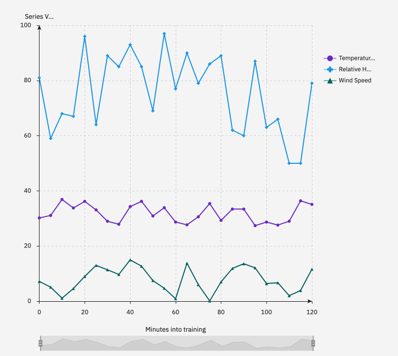
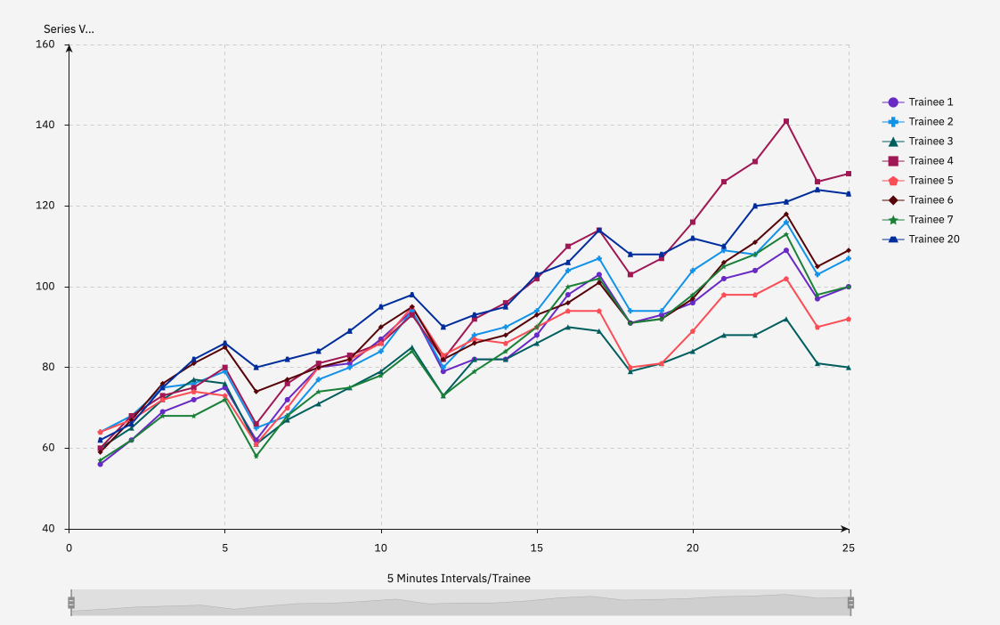

# Sprinkles-SprinkleSafely_SCDFXIBM
SCDF Innovation Challenge 2020\
Problem Statement: **Climate Change**\
\
*Climate change is inevitable, with projected increase in temperatures leading to phenomena such as the Urban Heat Island effect. This leads to an environment and climate where it is increasingly physically challenging for First Responders to train and operate to maximum efficiency and performance. How might SCDF **leverage wearables or other technologies** to provide **relief or enhancement in harsh operating conditions** and **maximise the safety, health and performance of First Responders** during **training** and **operations**?*

Technology and wearables: Kestrel WBGT, Fitbit
Relief and Enhancement: Variable Safety Management System driven by data

## Contents
1. [Short Description](#short-description)
2. [Pitch Video](#pitch-video)
3. [Architecture of Solution](#architecture-of-solution)
4. [Detailed Solution](#detailed-solution)
5. [Getting Started](#getting-started-installation)
6. [Running the Tests](#running-the-tests)
7. [Live Demo](#live-demo)
8. [Built With](#built-with)

## Short Description
Climate Change is a phenomena that is difficult for people to respond to, due to its fuzzy definitions and slow and gradual changes that is hard to notice until is too late. We can see how terribly humans have responded to it all across the world –– there are deniers, unexpected surge of wildfires, hottest decade recorded, the city of Venice sinking, droughts and floods. Humans are generally **reactive** rather than **proactive** when it comes to climate problems, this is also partly because of the sheer scale of collaboration and ingenuity it goes to invent meaningful solutions that can actually alleviate the situation.

In Singapore, fortunately we have ample infrastructure that keep our citizens comfortable despite the hot weather. We are also minimally affected by the climate-induced natural disaster that countries all over the world are faced with. However, we can be certain that the hotter weather has made it harder for critical outdoor operations and trainings to take place, especially amongst our National Servicemen. We are not exactly sure of SCDF's safety protocols regarding heat injuries, but it can be said that it is difficult for these protocols to be **scientifically determined** and **realistically executed** on the ground conditions that is suitable for every individual's conditioning.

We would like to propose a proactive approach that seeks to minimise the guesswork and decision-making struggles that commanders face when balancing training intensity and safety. This would be driven by real-time datasets collected from every individual soldier who would be monitored for the duration of physical activities. A cloud system (like *IBM Auto AI*) can simultanoeusly compare the cluster of data with each other to see if there are anomalies (patterns that signify an imminent heat injury). Conversely, it also can inform the commanders about the success of the training, whether individual trainees have actually worked hard and responded well to the physical conditionings.

## Pitch Video
Video: (Marcus put here when its done)

Description:
We introduce the environmental factors which affect one's body vitals and the possible health risks associated with these environmental factors.

We show demonstrate how our solution, the fitbit device, allows one to detect the changes in external environment temperature, as well as one's heart rate. The information provided to the fitbit device will remind the trainee with notifications such as "Reduce Training Intensity, High Heart Rate" when necessary, to ensure the safety and health of the trainee.

Next, we demonstrate how using our solution allows one to monitor their body's vitals and their external environment to ensure that training is conducted safely.

## Architecture of Solution
Weather data: https://data.gov.sg/dataset/realtime-weather-readings

Weather forecast: https://data.gov.sg/dataset/weather-forecast

Algorithm:
Collect real-time weather data with training.
Collect real-time data of trainee’s vitals during training. (Include parameters such as initial hydration, heartbeat, uninterrupted rest time)
Process both data to look for correlations. Use well-founded indicators to determine dangerous boundaries in data.
With prolonged use, this can be used to aid in adapting future safety measures to keep up with climate change trends. (instead of changes that follow after operation accidents)

Frontend: If the system proves sound and reliable, any officer can interact with it directly to decide on rest times, sustained training durations, intensities. They do not have to take guesses on the trainees’ physical conditions, this allows for personalised monitoring of every individual so that if there are vulnerable trainees, they can be quickly identified.

## [Detailed Solution](DESCRIPTION.md)

## Getting Started (Installation)

## Running the Tests

## Live Demo

A sample data set of both **weather** and **trainee heart rate** data taken in sync using *5 minute intervals* in a *2 hour physical training session*.

Figure 1: Temperature, relative humidity and wind speed recorded from Kestrel WBGT

Figure 2: A fraction of trainees' heart rate over time, ***notice Trainee 20's heart rate***. You can see the trainees' heart rate decrease during the intermittent 5 minute rests.
  
At the end of the training, the system would alert the commander to check on Trainee's 20 status as he has a sustained elevated heart rate even during periods of rest that is symptomatic of heat injury.\
This is something that human commanders will never be able to tell, especially when handling a large group of trainees and if trainee 20 was afraid of speaking up. In the future, the commander will learn to pay special care to trainee 20, thereby preventing a needless heat injury from occurring that would sabotage operational confidence and efficiency. The added benefit amassing fitness data is for commanders to accurately gauge the fitness levels of every individuals, novel training plans can be adopted by having personalised data. Once there is enough data to make the AI reliable (small margin of error), future commanders can confidently design training plans based on the current personalised data of their platoons instead of playing by ear.

## Built with
* IBM Cloudant - To host all the data streams and administrative tools for the user to access the live status
* IBM IBM Watson Studio (Data Refinery, Auto AI)
* IBM Watson Assistant - Voice-enabled chatbot frontend

## Authors
Johnathan, Marcus, Xuan Ming, YiJia

